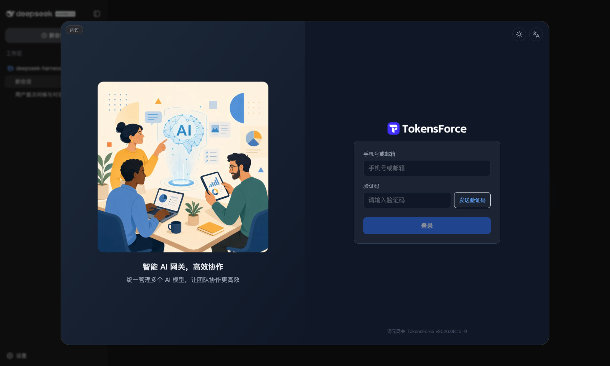
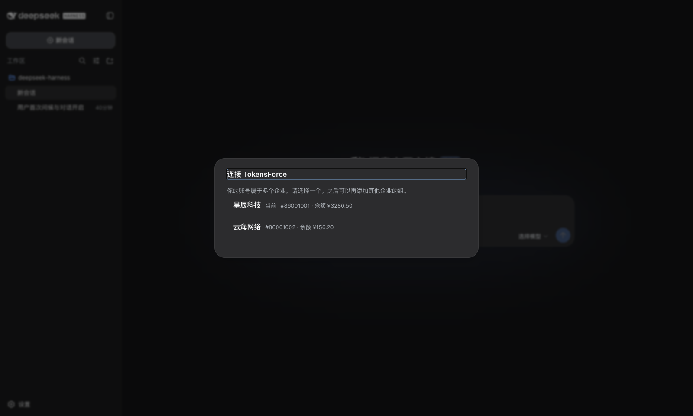

# dsh-tokensforce-login

[](https://www.npmjs.com/package/dsh-tokensforce-login)
[](LICENSE)

为 [DeepSeek Harness](https://github.com/deepseek-ai/deepseek-harness)（`dsh`）接入 [TokensForce](https://tokensforce.com) 词元网关：**登录一次，模型即用**。不需要手动填 API Key，不需要改配置文件。



## 安装

```sh
dsh plugin --profile web add dsh-tokensforce-login
dsh web
```

打开 `http://127.0.0.1:3080`，登录向导会自动弹出。

> 如果 `dsh plugin add` 报 `ERR_PNPM_ADDING_TO_ROOT`（旧版 pnpm），在
> `~/.dsh/profiles/web` 目录下手动 `pnpm add -w dsh-tokensforce-login`，
> 再把包名加入该目录 `package.json` 的 `dsh.profile.bundles` 列表即可。

## 使用

1. **首跑**：dsh 启动且尚未配置任何模型时，自动弹出近全屏的 TokensForce 登录窗口
   （就是 tokensforce.com 的登录页，邮箱验证码登录，与网页版完全一致）；
2. **选企业 / 选组**：账号属于多个企业或企业下有多个组时让你选，只有一个则自动跳过；
3. **完成**：所选组的 API Key 与网关地址自动写入，选个模型就能开始对话。
   每个组在「设置 → 模型」里是一行独立的提供方，可编辑、删除、发现模型。

**之后再添加其他组**：打开设置，点右上角的「连接 TokensForce」按钮。
登录态保留 7 天，期间添加新组不用重新登录。



## 常见问题

**装上后官方 DeepSeek 提供方去哪了？**
本插件会禁用 `llm-deepseek` 的首跑引导，避免开屏出现两处要 Key 的提示；
模型引擎仍走 dsh 自带的 OpenAI 兼容通道。卸载插件即恢复原状。

**我们公司自己部署了 tokensforce，能用吗？**
能。安装后把 `node_modules/dsh-tokensforce-login/lib/client.js` 里的
`SITE_ORIGIN` 改成你的站点地址并重启 dsh；站点侧需放行登录页嵌入
（nginx 对 `/login` 不发 `X-Frame-Options` 等，可参考 tokensforce 的实现）。
更正式的做法是 fork 本仓库，改 `src/client/logic.ts` 中的常量后自行构建。

**密钥存在哪？**
组密钥经 dsh 自带的凭据机制存在你本机（`~/.dsh/.credentials.yaml`），
浏览器只保留登录态（JWT，7 天有效）。模型请求由 dsh 宿主进程直连网关，
不经过浏览器。

## 反馈

- 使用问题：[Issues](https://github.com/spirits001/dsh-tokensforce-login/issues)
- 维护与二次开发：见 [CONTRIBUTING.md](CONTRIBUTING.md)

## License

[MIT](LICENSE)
